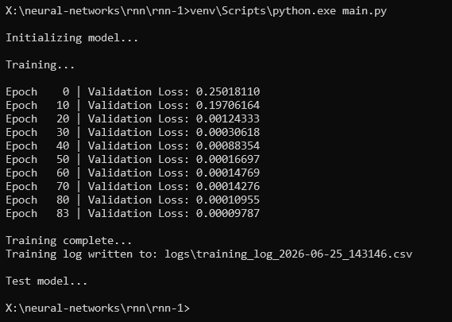
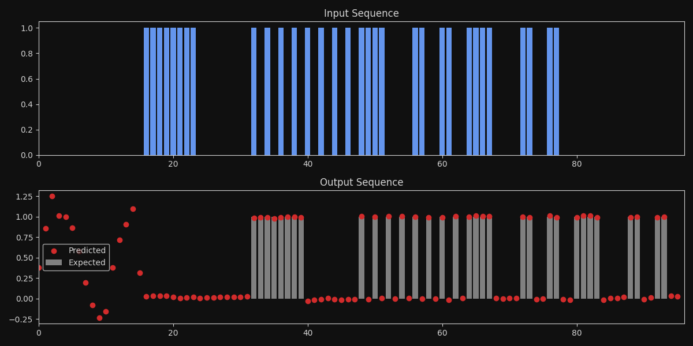

# Recurrent Neural Network (RNN) — Reference Application

**Version:** 1.2  

---

<div align="center">
  <table>
    <tr>
      <td align="center">
        
      </td>
      <td align="center">
        
      </td>
    </tr>
  </table>
</div>


---

## 📑 Table of Contents

1. [📖 Overview](#-overview)
2. [🧮 Mathematical Overview](#-mathematical-overview)
3. [📦 Installation & Dependencies](#-installation--dependencies)
4. [🚀 How to Run](#-how-to-run)
5. [📁 Project Structure](#-project-structure)
6. [📝 Usage Notes](#-usage-notes)
7. [📜 License](#-license)

---

## 📖 Overview
A simple **Recurrent Neural Network (RNN)** designed to serve as a reference template for machine learning projects that model time series prediction and classification.

The test case implements a **delayed copy task**. The task tests the network’s ability to remember inputs across a fixed time delay and reproduce them accurately at a later point.

### Key Features
- **Simple PyTorch RNN** architecture
- **Binary delayed copy task** for sequence learning
- **Gradient clipping** to avoid exploding gradients
- **Early stopping** based on validation loss
- **Visualization** of test results using Matplotlib

The code is intentionally minimal and demonstrates how to perform the following tasks:
1. Create a delayed copy of a binary input sequence.
2. Train an RNN to reproduce the delayed signal.
3. Evaluate and visualize the network’s output predictions versus the expected output.

---

## 🧮 Mathematical Overview

### 1. RNN Recurrence
At each time step $t$, the RNN takes an input vector $x_t$ (in this project, a single scalar value treated as a 1D feature) and a hidden state $h_{t-1}$ from the previous time step. The update rule in a basic recurrent neural network (using the $tanh$ nonlinearity) is:

$$ h_t = tanh \Big( W_{ih}x_t + b_{ih} + W_{hh}h_t + b_{hh}  \Big) $$

Where:
- $W_{ih}$ and $b_{ih}$ are the input-to-hidden weights and biases.
- $W_{hh}$ and $b_{hh}$ are the hidden-to-hidden weights and biases.
- $tanh$ is the hyperbolic tangent activation function.

### 2. Output Computation
The hidden state $h_t$ is then mapped to an output $y_t$ (again a single value per time step in this project):

$$ y_t = W_{ho}h_t + b_{ho}  $$

where $W_{ho}$ and $b_{ho}$ are the hidden-to-output layer weights and biases.

### 3. Delayed Copy Task
We create a sequence $x = \{x_1, x_2, x_3, ..., x_T\}$ of binary values $x_i \in \{0,1\}$. We define a delay $\delta$, and the target sequence $y$ is:

$$y_{t+\delta} = x_t \quad \text{for} \; 1 \leq t \leq T - \delta, \quad \text{and} \quad y_t = 0 \; \text{otherwise}.$$

Effectively, the network is trying to produce a shifted version of the input sequence, shifted by $\delta$ time steps.

### 4. Loss Function
The model is trained via Mean Squared Error (MSE) loss. Let $\hat{y}_t$ be the predicted output at time step $t$. The loss for a batch is computed by:

$$
\mathcal{L} = \frac{1}{N} \sum_{i=1}^{N} \sum_{t=\delta+1}^{T} \bigl( y_t - \hat{y}_t \bigr)^2,
$$

where we only calculate the loss for the portion of the sequence after the delay $\delta$, since that is where the targets are non-zero.

### 5. Training
Parameters are updated using gradient-based optimization (Adam in this implementation). At each training step:
1. A new synthetic batch of sequences is generated.
2. The forward pass computes predictions $\hat{y}_t$.
3. The loss $\mathcal{L}$ is backpropagated.
4. Gradients are clipped to mitigate exploding gradient issues.
5. The parameters are updated.

An **early stopping** condition is applied when the validation loss falls below a specified threshold.

---

## 📦 Installation & Dependencies
- [Python 3.7+](https://www.python.org/)
- [PyTorch](https://pytorch.org/) (Tested with version >= 1.7)
- [NumPy](https://numpy.org/)
- [Matplotlib](https://matplotlib.org/)

You can install the dependencies by running:

```
pip install torch numpy matplotlib
```
Or, run the batch file `venv_install_requirements.bat`, which will install the dependencies listed in `venv_requirements.txt`.

## 🚀 How to Run
1. Clone or Download this repository.
2. Navigate to the `src` directory (`cd src`) — it holds the source code together with the run and virtual-environment batch files.
3. Install Python dependencies, `pip install torch numpy matplotlib`, or `venv_install_requirements.bat`.
4. Activate the Python virtual environment, at the prompt `venv\scripts\activate`. Or by executing the batch file `venv_activate.bat`.
5. Run the Python script, `python main.py` (or `run.bat`).

All together (from the repository root):

```
> cd src
> python -m venv venv
> venv\scripts\activate
> pip install torch numpy matplotlib
> python main.py
```

## 📁 Project Structure

```
RNN-Recurrent-Neural-Network
├─ README.md                           Project documentation (this file).
├─ LICENSE                             MIT license.
├─ media
│  └─ images
│     └─ screenshots
│        ├─ terminal-1.png             Terminal training output.
│        └─ figure-1.png               Output visualization (predicted vs. expected).
└─ src                                 Run dir: activate the venv here, then run.
   ├─ main.py                          RNN model, training, and testing.
   ├─ run.bat                          Runs `python main.py`.
   ├─ venv_requirements.txt            Python project dependencies.
   ├─ venv_install_requirements.bat    Install dependencies from venv_requirements.txt.
   ├─ venv_save_requirements.bat       Save dependencies to venv_requirements.txt.
   ├─ venv_create.bat                  Create the Python virtual environment.
   ├─ venv_activate.bat                Activate the Python virtual environment.
   ├─ venv_deactivate.bat              Deactivate the Python virtual environment.
   └─ venv_delete.bat                  Delete the Python virtual environment.
```

### Main Code Sections

- **ClassicalRNN**
  * Implements a simple RNN with a linear output layer.
  * Contains methods for generating synthetic delayed copy data, performing a training step, validation, and model training.

- **RNNTester**
  * Encapsulates testing logic (manual sequence testing, plotting the results) and orchestrates the training and testing.

- **main**
  * Creates an instance of `RNNTester` and runs it.

## 📝 Usage Notes

1. **Hyperparameters:**

   - You can adjust the sequence length, delay, learning rate, hidden size, etc., in the Constants section at the top of main.py.

2. **Visualization:**

   - The final plot will display:
     - A binary input sequence.
     - The model’s predictions.
     - The expected output (original input sequence shifted by the specified delay).

3. **Exploding Gradients:**

   - To prevent exploding gradients, the code applies gradient clipping based on a maximum allowed norm.

## 📜 License

Released under the [MIT License](LICENSE) — Copyright © 2025 Rohin Gosling.
